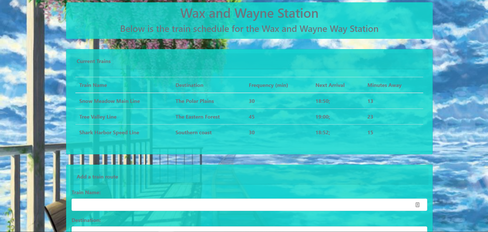

# Train-Timetable

<h1>Description<h1>
  
<h6>This is a web application to demonstrate the use of a working firebase database with user interface that responds in real time. Using a theme of a train station time table, Users are able to view all current trains and various details related to that route. Users are also able to add their own routes to the database for tracking.</h6>
  
<h1> View the page here!</h1>
* [Click this link to view the live site](https://cmoconnor0823.github.io/Train-Timetable/)
  
<h2> Application in action </h2>
<h6>On page load the table will append with data stored in the database, listing several different trains and the data associated with each one. The page will also actively compare the arrivial time to the user's local time and display minutes until next arrival, using Moment.js. Finally the page will update periodically with current minutes left until the applicable train arrives. Users can also enter their own train route to the database and watch it append in real time to the train schedule.</h6>

 

 

<h2>Technology</h2>
<h6>This page was built with Html, and the following technologies:</h6>

* [BootStrap](https://getbootstrap.com/)

* [Css](https://developer.mozilla.org/en-US/docs/Web/CSS#targetText=Cascading%20Style%20Sheets%20(CSS)%20is,speech%2C%20or%20on%20other%20media.)

* [Moment.js](https://momentjs.com/)

* [Firebase](https://firebase.google.com/)

* [Git Bash](https://gitforwindows.org/)

* [Visual Studio Code](https://code.visualstudio.com/)

* [JavaScript](https://developer.mozilla.org/en-US/docs/Web/JavaScript/Reference)

For comments/ concerns contact the project 
Author: Caitlin O'Connor  
At: Cmoconnor0823@gmail.com

